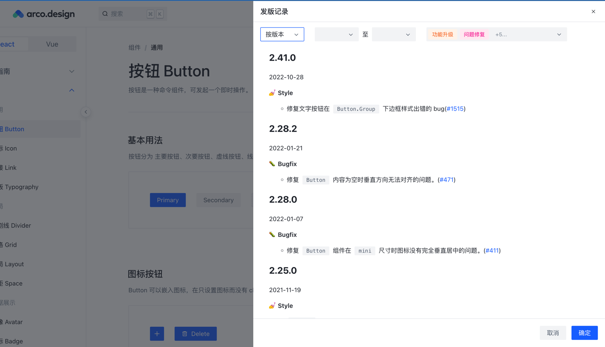
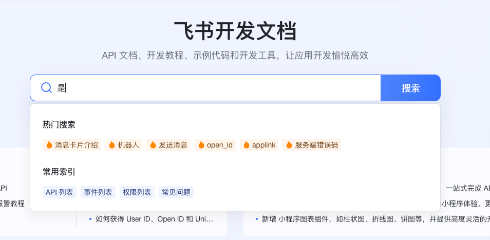
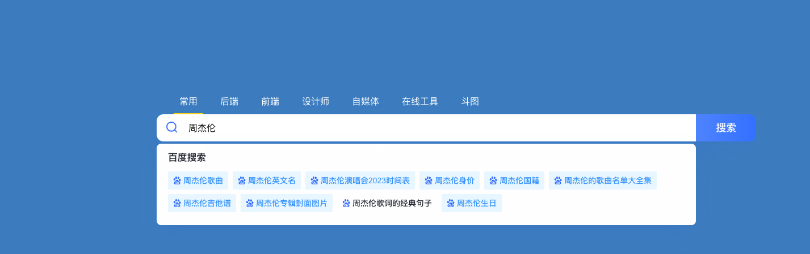
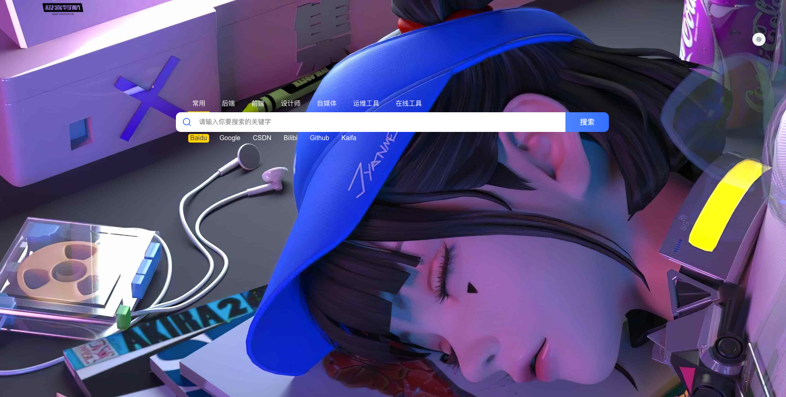
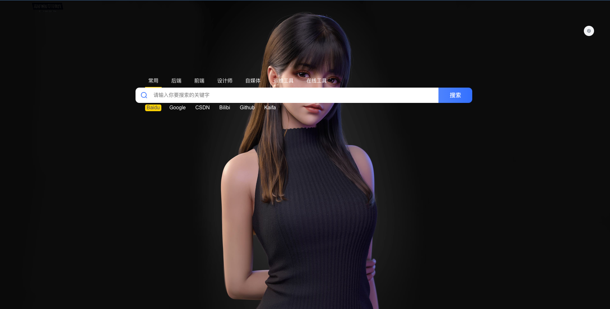
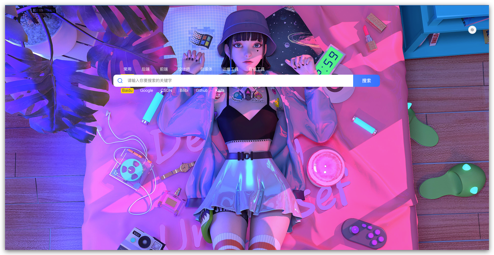
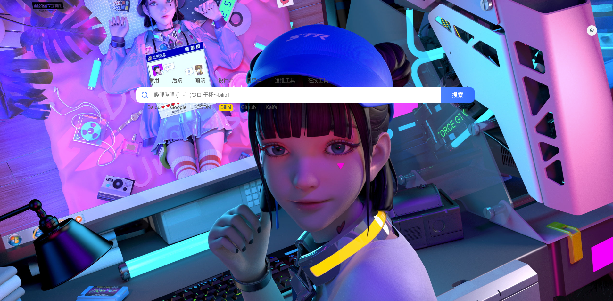

# dev-springlearn2


## 案例1

- 常用
- 后端
- 前端
- 运维
- 设计师
	- 颜色搭配
	- 设计参考
		- 谷歌自动作画 https://www.autodraw.com/
	- 搜图网站
	- 素材设计
- 摸鱼
	- 迷惑办公
		- 电脑升级 https://www.tuboshu.mobi/fakeupdate
- 娱乐


1. 搜索框添加回车事件
2. 搜索框添加失去焦点事件
3. 发布记录



超级搜索



百度词汇联想
- https://www.baidu.com/sugrec?pre=1&p=3&ie=utf-8&json=1&prod=pc&wd=pgone


kaifa
- https://kaifa.baidu.com/rest/v1/recommend/suggests?wd=spring


B站
- https://s.search.bilibili.com/main/suggest?term=%E6%99%BA%E6%85%A7


知乎

- https://www.zhihu.com/api/v4/search/suggest?q=

已经访问过的关键字会被标记


### 渐变风格

```css 
    background-image: linear-gradient(
      45deg,
      rgb(90, 54, 148) 0%,
      rgb(19, 189, 206) 33%,
      rgb(0, 148, 217) 66%,
      rgb(111, 199, 181) 100%
    );
    background-size: 400%;
    background-position: 0 100%;
    -webkit-animation: gradient 15s ease-in-out infinite;
    animation: bganimation-114fda31 15s ease-in-out infinite;
```

注意: `bganimation-114fda31` 因为vue中样式是由作用域的,所以要在动画后加上元素的作用域


### 极简飞书风格

搜索分类文本样式: `#504f4f`

```css 
    background-color: #f0f4ff;
    background-image: url('https://sf3-scmcdn2-cn.feishucdn.com/lark/open/doc/frontend/images/home-banner-left-572185fb.png'),url('https://sf3-scmcdn2-cn.feishucdn.com/lark/open/doc/frontend/images/home-banner-right-c40ab17b.png');
    background-position: 0,100%;
    background-repeat: no-repeat,no-repeat;
```


### 
chrome://flags/
关闭跨域 Block insecure private network requests


### 二次元风格



```css 
   background-color: #f0f4ff;
   background-size: cover;
   background-repeat: no-repeat;
   background-position: right top;
   background-image: url('https://img.springlearn.cn/blog/5523c88dd347d1b7cc617f632b7efdb7.jpeg'), linear-gradient(rgb(219, 166, 166), rgb(0, 0, 172));
```


```css 
   background-color: #f0f4ff;
   background-size: cover;
   background-repeat: no-repeat;
   background-image: url('https://img.springlearn.cn/blog/83b872730d3ab4a502c2ae5d73db4dee.jpeg'), linear-gradient(rgb(219, 166, 166), rgb(0, 0, 172));
```



```css 
   background-color: #f0f4ff;
   background-size: cover;
   background-repeat: no-repeat;
   background-image: url('https://s1.ax1x.com/2022/12/31/pS9H7Rg.jpg'), linear-gradient(rgb(219, 166, 166), rgb(0, 0, 172));
```



```css 
   background-color: #f0f4ff;
   background-size: cover;
   background-repeat: no-repeat;
   background-image: url('https://s1.ax1x.com/2022/12/31/pS9b8eI.jpg');
```


极简模式
